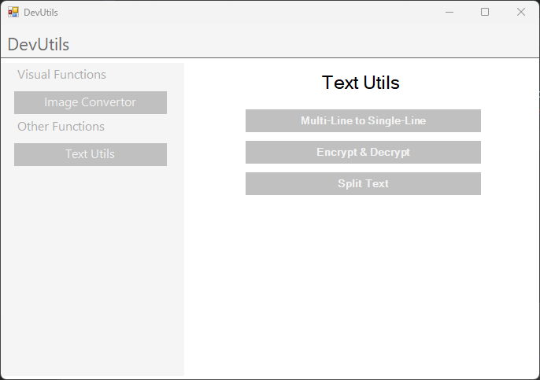

# DevUtils

## Description

Dev Utils is a lightweight Windows Forms application designed to provide a collection of utility functions for image and text manipulation. It's a self-contained application, requiring no internet connection and boasting a small footprint (less than 1MB).

## Features

*   **Image Conversion:** Converts images to the following formats:
    *   .png
    *   .jpeg
    *   .gif
    *   .bmp
    *   .tiff
    *   .ico
    *   .wmf
*   **Text Manipulation:**
    *   Multi-line to single-line conversion.
    *   AES Encryption/Decryption.
    *   Text splitting by character or string.

## Requirements

*   **Operating System:** Windows
*   **.NET Framework:** 4.7.2 (or higher) - *This is a requirement for the application to run.*

## Technical Details

*   **Language:** C#
*   **Platform:** Windows Forms

## Size

The application is less than 1MB.

## Getting Started

1.  Download the executable file (`.exe`).
2.  Ensure you have .NET Framework 4.7.2 or higher installed.
3.  Run the executable.

## Notes

*   The application is designed to be a standalone tool and does not require an internet connection.
